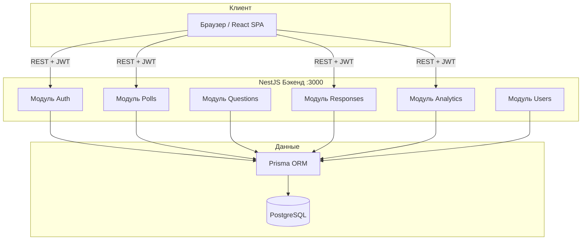
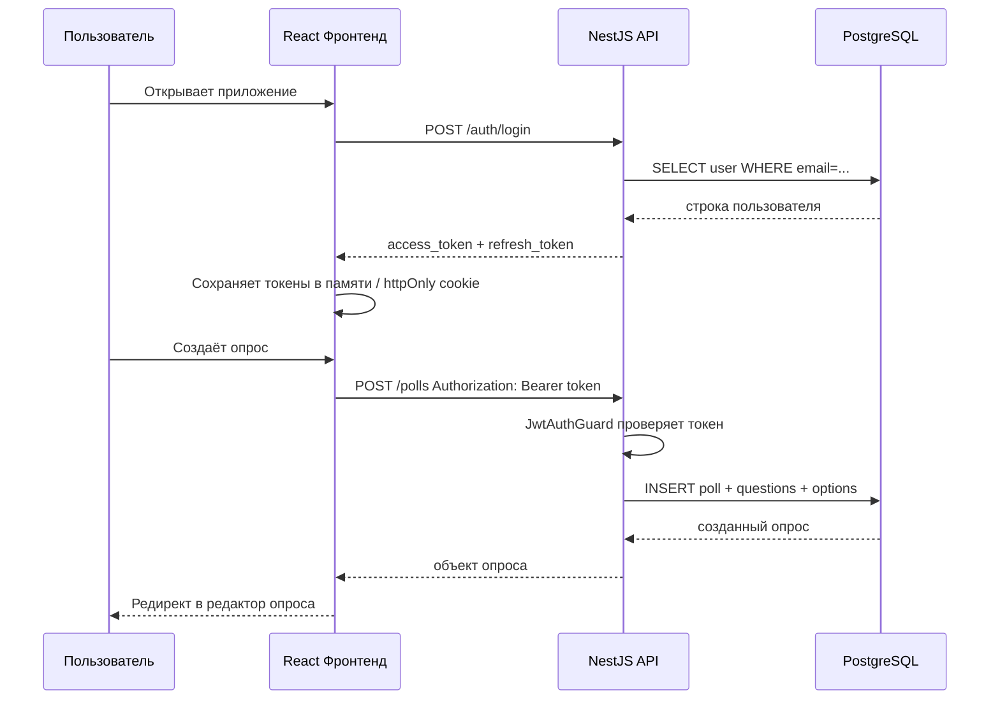
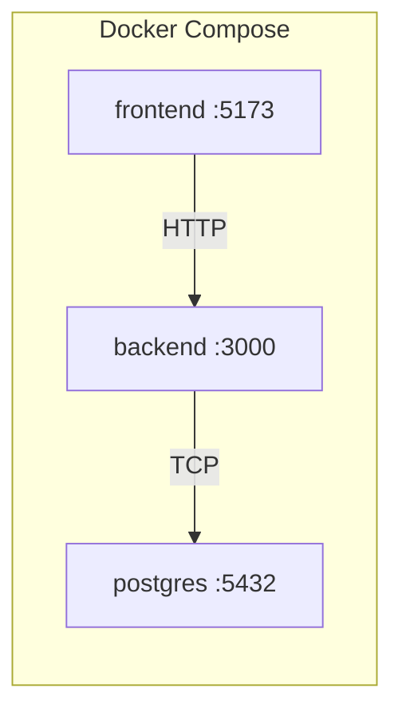

# Polls App — Системная архитектура

## Высокоуровневая архитектура

## Поток запроса

## Описание компонентов

### Модули бэкенда

| Модуль | Ответственность |
|---|---|
| `AuthModule` | Регистрация, вход, обновление токена, выход |
| `UsersModule` | CRUD пользователей, управление ролями |
| `PollsModule` | CRUD опросов, генерация slug, видимость |
| `QuestionsModule` | CRUD вопросов и вариантов ответов (вложено в опросы) |
| `ResponsesModule` | Отправка и получение ответов |
| `AnalyticsModule` | Агрегированная статистика, экспорт CSV |

### Страницы фронтенда

| Маршрут | Страница | Требует авторизации |
|---|---|---|
| `/` | Лендинг / лента публичных опросов | Нет |
| `/login` | Форма входа | Нет |
| `/register` | Форма регистрации | Нет |
| `/dashboard` | Список моих опросов | Да |
| `/polls/new` | Конструктор опроса | Да |
| `/polls/:slug/edit` | Редактирование опроса | Да (владелец) |
| `/polls/:slug` | Прохождение опроса | Нет (публичный) / Ссылка (приватный) |
| `/polls/:slug/results` | Страница аналитики | Да (владелец) |
| `/admin` | Панель администратора | Да (admin) |

## Инфраструктура

### Сервисы Docker Compose

| Сервис | Образ | Порт |
|---|---|---|
| `postgres` | `postgres:16-alpine` | 5432 |
| `backend` | Кастомный Dockerfile | 3000 |
| `frontend` | Кастомный Dockerfile | 5173 |

## Безопасность

- Пароли хешируются через `bcrypt` (rounds: 12)
- TTL access-токена: 15 минут
- TTL refresh-токена: 7 дней, хранится в httpOnly cookie
- Приватные опросы доступны только по секретной ссылке (UUID-токен в URL)
- Rate limiting на эндпоинтах аутентификации (10 запросов/мин с одного IP)
- Валидация входных данных через `class-validator` на всех DTO
- CORS настроен только на origin фронтенда
