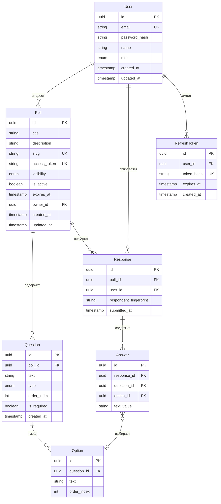

# Polls App — Модели данных

## Диаграмма сущностей (ERD)



## Prisma-схема

```prisma
// schema.prisma

generator client {
  provider = "prisma-client-js"
}

datasource db {
  provider = "postgresql"
  url      = env("DATABASE_URL")
}

enum Role {
  USER
  ADMIN
}

enum Visibility {
  PUBLIC
  PRIVATE
}

enum QuestionType {
  SINGLE_CHOICE
  MULTIPLE_CHOICE
  TEXT
}

model User {
  id           String   @id @default(uuid())
  email        String   @unique
  passwordHash String   @map("password_hash")
  name         String
  role         Role     @default(USER)
  createdAt    DateTime @default(now()) @map("created_at")
  updatedAt    DateTime @updatedAt @map("updated_at")

  polls         Poll[]
  responses     Response[]
  refreshTokens RefreshToken[]

  @@map("users")
}

model Poll {
  id          String     @id @default(uuid())
  title       String
  description String?
  slug        String     @unique
  accessToken String     @unique @default(uuid()) @map("access_token")
  visibility  Visibility @default(PUBLIC)
  isActive    Boolean    @default(true) @map("is_active")
  expiresAt   DateTime?  @map("expires_at")
  ownerId     String     @map("owner_id")
  createdAt   DateTime   @default(now()) @map("created_at")
  updatedAt   DateTime   @updatedAt @map("updated_at")

  owner     User       @relation(fields: [ownerId], references: [id], onDelete: Cascade)
  questions Question[]
  responses Response[]

  @@map("polls")
}

model Question {
  id          String       @id @default(uuid())
  pollId      String       @map("poll_id")
  text        String
  type        QuestionType
  orderIndex  Int          @map("order_index")
  isRequired  Boolean      @default(true) @map("is_required")
  createdAt   DateTime     @default(now()) @map("created_at")

  poll    Poll     @relation(fields: [pollId], references: [id], onDelete: Cascade)
  options Option[]
  answers Answer[]

  @@map("questions")
}

model Option {
  id         String @id @default(uuid())
  questionId String @map("question_id")
  text       String
  orderIndex Int    @map("order_index")

  question Question @relation(fields: [questionId], references: [id], onDelete: Cascade)
  answers  Answer[]

  @@map("options")
}

model Response {
  id                    String   @id @default(uuid())
  pollId                String   @map("poll_id")
  userId                String?  @map("user_id")
  respondentFingerprint String?  @map("respondent_fingerprint")
  submittedAt           DateTime @default(now()) @map("submitted_at")

  poll    Poll     @relation(fields: [pollId], references: [id], onDelete: Cascade)
  user    User?    @relation(fields: [userId], references: [id], onDelete: SetNull)
  answers Answer[]

  @@unique([pollId, userId])
  @@map("responses")
}

model Answer {
  id         String  @id @default(uuid())
  responseId String  @map("response_id")
  questionId String  @map("question_id")
  optionId   String? @map("option_id")
  textValue  String? @map("text_value")

  response Response @relation(fields: [responseId], references: [id], onDelete: Cascade)
  question Question @relation(fields: [questionId], references: [id], onDelete: Cascade)
  option   Option?  @relation(fields: [optionId], references: [id], onDelete: SetNull)

  @@map("answers")
}

model RefreshToken {
  id        String   @id @default(uuid())
  userId    String   @map("user_id")
  tokenHash String   @unique @map("token_hash")
  expiresAt DateTime @map("expires_at")
  createdAt DateTime @default(now()) @map("created_at")

  user User @relation(fields: [userId], references: [id], onDelete: Cascade)

  @@map("refresh_tokens")
}
```

## Примечания по полям

### `Poll.slug`
- Человекочитаемый идентификатор URL, например `my-awesome-poll-a3f2`
- Генерируется при создании: `kebab-case(title) + '-' + nanoid(4)`
- Должен быть уникальным среди всех опросов

### `Poll.accessToken`
- UUID для доступа к приватному опросу: `/polls/private/:accessToken`
- Может быть перегенерирован владельцем

### Дедупликация `Response`
- Авторизованные пользователи: уникальное ограничение на `(pollId, userId)`
- Анонимные пользователи: `respondentFingerprint` (хеш отпечатка браузера) используется для мягкой дедупликации (best-effort)

### `Answer` для разных типов вопросов
| Тип вопроса | `optionId` | `textValue` |
|---|---|---|
| `SINGLE_CHOICE` | заполнен | null |
| `MULTIPLE_CHOICE` | заполнен | null |
| `TEXT` | null | заполнен |
