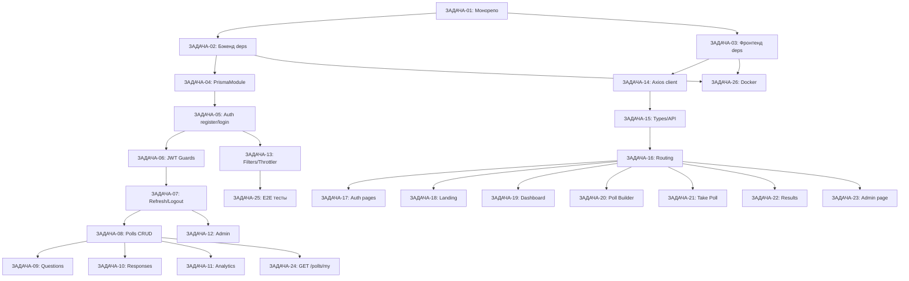

# Руководство для агентов-имплементаторов

Этот документ описывает правила, соглашения и процесс работы для AI-агентов, реализующих задачи из [`06-implementation-tasks.md`](06-implementation-tasks.md).

---

## 1. Как читать задачи

Каждая задача в `06-implementation-tasks.md` имеет структуру:

```
### ЗАДАЧА-XX: Название
**Ссылки:** ссылки на спецификации
**Инструкции:** пошаговые действия
**Результат:** что должно работать после выполнения
```

**Правила:**
- Выполняй задачи **строго по порядку** — каждая задача зависит от предыдущих
- Перед началом задачи **прочитай все указанные спецификации**
- Не добавляй функциональность, которая не описана в спецификации
- Если что-то неясно — следуй принципу минимального удивления (least surprise)

---

## 2. Карта зависимостей задач



---

## 3. Соглашения по коду

### Бэкенд (NestJS)

#### Структура файлов модуля
```
src/module-name/
├── module-name.module.ts
├── module-name.controller.ts   # только HTTP-слой, без бизнес-логики
├── module-name.service.ts      # вся бизнес-логика здесь
├── guards/
│   └── guard-name.guard.ts
└── dto/
    ├── create-xxx.dto.ts
    └── update-xxx.dto.ts
```

#### Именование
| Тип | Пример |
|---|---|
| Модуль | `PollsModule` |
| Контроллер | `PollsController` |
| Сервис | `PollsService` |
| DTO | `CreatePollDto`, `UpdatePollDto` |
| Гард | `JwtAuthGuard`, `PollOwnerGuard` |
| Стратегия | `JwtStrategy` |

#### Обязательные декораторы на контроллерах
```typescript
@ApiTags('polls')           // Swagger группировка
@Controller('polls')
export class PollsController {

  @Get()
  @ApiOperation({ summary: 'Список публичных опросов' })
  @ApiResponse({ status: 200, description: 'Успешно' })
  findAll() {}

  @Post()
  @UseGuards(JwtAuthGuard)
  @ApiBearerAuth()
  create() {}
}
```

#### Обработка ошибок
Всегда бросай стандартные NestJS-исключения — они будут перехвачены `HttpExceptionFilter`:
```typescript
throw new NotFoundException('Опрос не найден');
throw new ForbiddenException('Нет доступа');
throw new ConflictException('Вы уже отвечали на этот опрос');
throw new GoneException('Срок опроса истёк');
```

#### Транзакции Prisma
Для операций, затрагивающих несколько таблиц, используй `$transaction`:
```typescript
await this.prisma.$transaction(async (tx) => {
  const poll = await tx.poll.create({ data: pollData });
  await tx.question.createMany({ data: questionsData });
  return poll;
});
```

#### Пагинация
Используй утилиту из `src/common/utils/pagination.ts`:
```typescript
// Стандартный ответ пагинации
return {
  data: items,
  total: count,
  page: query.page,
  limit: query.limit,
};
```

---

### Фронтенд (React)

#### Структура компонента
```typescript
// src/components/polls/PollCard.tsx

import type { PollSummary } from '@/types/poll';

interface PollCardProps {
  poll: PollSummary;
}

export function PollCard({ poll }: PollCardProps) {
  return (
    // JSX
  );
}
```

#### Именование
| Тип | Пример |
|---|---|
| Компонент | `PollCard`, `QuestionBuilder` |
| Страница | `DashboardPage`, `TakePollPage` |
| Хук | `usePolls`, `useAnalytics` |
| Стор | `authStore` |
| API-функция | `createPoll`, `submitResponse` |
| Тип | `Poll`, `PollSummary`, `AnalyticsData` |

#### React Query — обязательный паттерн
```typescript
// Получение данных
const { data, isLoading, error } = useQuery({
  queryKey: ['polls', slug],
  queryFn: () => getPoll(slug),
});

// Мутация
const mutation = useMutation({
  mutationFn: createPoll,
  onSuccess: () => {
    queryClient.invalidateQueries({ queryKey: ['my-polls'] });
    toast.success('Опрос создан!');
  },
  onError: (error) => {
    toast.error(getErrorMessage(error));
  },
});
```

#### Обработка состояний загрузки
Всегда обрабатывай три состояния:
```typescript
if (isLoading) return <Spinner />;
if (error) return <ErrorMessage message={error.message} />;
if (!data) return null;
return <Content data={data} />;
```

#### Формы — обязательный паттерн
```typescript
const schema = z.object({
  title: z.string().min(3, 'Минимум 3 символа').max(200),
  email: z.string().email('Некорректный email'),
});

type FormData = z.infer<typeof schema>;

const { register, handleSubmit, formState: { errors } } = useForm<FormData>({
  resolver: zodResolver(schema),
});
```

---

## 4. Работа с базой данных

### Правила Prisma-запросов

**Всегда выбирай только нужные поля:**
```typescript
// Хорошо
const poll = await this.prisma.poll.findUnique({
  where: { slug },
  select: {
    id: true,
    title: true,
    visibility: true,
    owner: { select: { id: true, name: true } },
    questions: {
      orderBy: { orderIndex: 'asc' },
      include: { options: { orderBy: { orderIndex: 'asc' } } },
    },
  },
});

// Плохо — тянет все поля включая passwordHash
const poll = await this.prisma.poll.findUnique({ where: { slug } });
```

**Никогда не возвращай `passwordHash` в ответах API.**

### Миграции
- Каждое изменение схемы = новая миграция: `npx prisma migrate dev --name описание`
- Не редактируй существующие миграции
- Имена миграций на английском в snake_case: `add_expires_at_to_polls`

---

## 5. Аутентификация и авторизация

### Матрица доступа

| Эндпоинт | Анонимный | USER | Владелец | ADMIN |
|---|---|---|---|---|
| `GET /polls` | ✅ | ✅ | ✅ | ✅ |
| `GET /polls/:slug` (PUBLIC) | ✅ | ✅ | ✅ | ✅ |
| `GET /polls/:slug` (PRIVATE) | ❌ (нужен accessToken) | ❌ (нужен accessToken) | ✅ | ✅ |
| `POST /polls` | ❌ | ✅ | — | ✅ |
| `PATCH /polls/:slug` | ❌ | ❌ | ✅ | ✅ |
| `DELETE /polls/:slug` | ❌ | ❌ | ✅ | ✅ |
| `POST /polls/:slug/responses` | ✅ | ✅ | ✅ | ✅ |
| `GET /polls/:slug/analytics` | ❌ | ❌ | ✅ | ✅ |
| `GET /admin/*` | ❌ | ❌ | ❌ | ✅ |

### Применение гардов
```typescript
// Обязательная авторизация
@UseGuards(JwtAuthGuard)

// Опциональная авторизация (анонимный доступ разрешён)
@UseGuards(OptionalJwtAuthGuard)

// Только владелец или admin
@UseGuards(JwtAuthGuard, PollOwnerGuard)

// Только admin
@UseGuards(JwtAuthGuard, AdminGuard)
```

---

## 6. Валидация данных

### Бэкенд — обязательные правила DTO

```typescript
// Все строки должны иметь ограничения длины
@IsString()
@MinLength(3)
@MaxLength(200)
title: string;

// Опциональные поля — явно помечать
@IsOptional()
@IsString()
description?: string;

// Enum-поля
@IsEnum(Visibility)
visibility: Visibility;

// Вложенные объекты
@IsArray()
@ValidateNested({ each: true })
@Type(() => CreateQuestionDto)
@ArrayMinSize(1)
questions: CreateQuestionDto[];
```

### Фронтенд — Zod-схемы

```typescript
// Схемы должны соответствовать DTO бэкенда
const createPollSchema = z.object({
  title: z.string().min(3, 'Минимум 3 символа').max(200, 'Максимум 200 символов'),
  description: z.string().optional(),
  visibility: z.enum(['PUBLIC', 'PRIVATE']),
  expiresAt: z.string().datetime().optional().nullable(),
  questions: z.array(questionSchema).min(1, 'Добавьте хотя бы один вопрос'),
});
```

---

## 7. Тестирование

### Что тестировать в E2E (ЗАДАЧА-25)

Для каждого критического пути проверяй:
1. **Happy path** — успешный сценарий
2. **Auth errors** — 401 без токена, 403 без прав
3. **Validation errors** — 400 при неверных данных
4. **Business logic errors** — 409 дубликат, 410 истёкший опрос

### Шаблон E2E-теста
```typescript
describe('PollsController (e2e)', () => {
  let app: INestApplication;
  let authToken: string;

  beforeAll(async () => {
    // Создать тестовое приложение
    // Зарегистрировать пользователя и получить токен
  });

  afterAll(async () => {
    await app.close();
  });

  it('POST /polls — создаёт опрос', async () => {
    const response = await request(app.getHttpServer())
      .post('/api/v1/polls')
      .set('Authorization', `Bearer ${authToken}`)
      .send(validPollDto)
      .expect(201);

    expect(response.body).toHaveProperty('slug');
    expect(response.body.title).toBe(validPollDto.title);
  });

  it('POST /polls — 401 без токена', async () => {
    await request(app.getHttpServer())
      .post('/api/v1/polls')
      .send(validPollDto)
      .expect(401);
  });
});
```

---

## 8. Чеклист перед завершением задачи

Перед тем как считать задачу выполненной, проверь:

### Бэкенд
- [ ] Все эндпоинты из спецификации реализованы
- [ ] DTO имеют полную валидацию через `class-validator`
- [ ] Swagger-декораторы добавлены на все эндпоинты
- [ ] Ошибки бросаются через стандартные NestJS-исключения
- [ ] `passwordHash` не возвращается в ответах
- [ ] Транзакции используются для операций с несколькими таблицами
- [ ] Модуль зарегистрирован в `AppModule`

### Фронтенд
- [ ] Все три состояния обработаны: loading / error / data
- [ ] Формы валидируются через Zod
- [ ] Toast-уведомления показываются при успехе и ошибке
- [ ] Компонент не делает прямых вызовов axios — только через функции из `src/api/`
- [ ] TypeScript-ошибок нет (`npm run type-check`)
- [ ] Tailwind-классы используются для стилизации (не inline-стили)

### Общее
- [ ] Нет `console.log` в продакшн-коде
- [ ] Нет захардкоженных URL или секретов
- [ ] Переменные окружения используются через `process.env` / `import.meta.env`

---

## 9. Частые ошибки и как их избежать

| Ошибка | Как избежать |
|---|---|
| Circular dependency в NestJS | Используй `forwardRef()` или вынеси общую логику в отдельный модуль |
| N+1 запросы к БД | Используй `include` в Prisma вместо отдельных запросов в цикле |
| Утечка токена в localStorage | `accessToken` хранить только в памяти (Zustand), не в `localStorage` |
| Гонка состояний при refresh токена | Используй очередь запросов — один refresh, остальные ждут |
| Забытый `await` в async-функции | Включи правило `@typescript-eslint/no-floating-promises` |
| Возврат `passwordHash` в ответе | Всегда используй `select` в Prisma или `exclude` утилиту |
| Сломанная пагинация | Всегда возвращай `total` вместе с `data` |

---

## 10. Порядок чтения спецификаций

При начале работы над задачей читай документы в таком порядке:

1. **[`00-overview.md`](00-overview.md)** — общее понимание проекта (один раз)
2. **[`02-data-models.md`](02-data-models.md)** — схема БД (перед любой задачей бэкенда)
3. **[`03-api-spec.md`](03-api-spec.md)** — контракт API (перед задачами бэкенда и фронтенда)
4. **[`05-backend-spec.md`](05-backend-spec.md)** — детали реализации бэкенда
5. **[`04-frontend-spec.md`](04-frontend-spec.md)** — детали реализации фронтенда
6. **[`06-implementation-tasks.md`](06-implementation-tasks.md)** — конкретная задача

---

## 11. Глоссарий

| Термин | Значение |
|---|---|
| `slug` | Человекочитаемый URL-идентификатор опроса, например `lyubimyy-tsvet-a3f2` |
| `accessToken` (poll) | UUID для доступа к приватному опросу через URL |
| `accessToken` (JWT) | JWT-токен авторизации пользователя (15 мин) |
| `refreshToken` | Долгоживущий токен для обновления JWT (7 дней, в httpOnly cookie) |
| `fingerprint` | Хеш отпечатка браузера для мягкой дедупликации анонимных ответов |
| `SINGLE_CHOICE` | Тип вопроса — один вариант ответа (radio) |
| `MULTIPLE_CHOICE` | Тип вопроса — несколько вариантов ответа (checkbox) |
| `TEXT` | Тип вопроса — свободный текстовый ответ (textarea) |
| `PUBLIC` | Видимость опроса — доступен всем в ленте |
| `PRIVATE` | Видимость опроса — доступен только по ссылке с `accessToken` |
| `isActive` | Флаг активности опроса — владелец может вручную закрыть опрос |
| `expiresAt` | Дата автоматического закрытия опроса |
